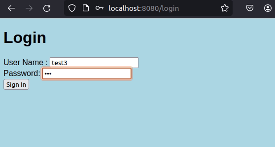

# SilkStore

- Online marketplace where multiple users can sell multiple products
- Registration & login features
- Profile feature
- Add product, edit product, delete product
- Product images with image upload
- PostGRE database

## Instructions

Maven project.
1. Open pom.xml in any IDE, import project.
2. Edit application.properties with your Postgre config (application requires a running Postgre DB)

## Images

## Demo 

