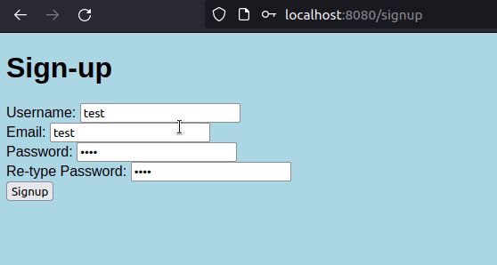

# SilkStore

- Online marketplace where multiple users can sell multiple products
- Registration & login features
- Profile feature
- Add product, edit product, delete product
- Product images
- Postgres database

## Instructions

Maven project.
1. Open pom.xml in any IDE, import project.
2. Edit application.properties with your Postgre config (application requires a running Postgre DB)

## Demo

https://boiling-beyond-76241-183e81e8439b.herokuapp.com

## Feature demonstration

